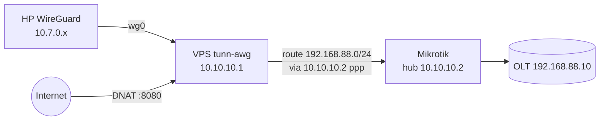

# Akses LAN di Belakang Mikrotik (OLT / Pelanggan) — dari Internet & dari HP

Setelah Mikrotik terkoneksi L2TP ke VPS, Anda bisa:

1. **NAT dari internet ke OLT**: `http://IP_VPS:8080` → panel OLT di `192.168.88.10:80`.
2. **HP (WireGuard) mengakses LAN Mikrotik**: buka `http://192.168.88.10` langsung dari HP.

Kedua kasus memakai fondasi yang sama: **hub** (akun L2TP milik Mikrotik dengan IP tunnel
statis) + **subnet LAN** terdaftar. VPS otomatis memasang route dan SNAT.



## Langkah 1 — Jadikan akun Mikrotik sebagai hub (IP statis)

Akun Mikrotik Anda saat ini (mis. `gr3`) mendapat IP **dinamis** dari pool `10.10.10.100-200`.
Route ke LAN butuh IP tetap. Di VPS:

```
vpn → 4 → 7
  Nama akun L2TP milik Mikrotik : gr3
  IP tunnel statis [auto]       : (Enter → 10.10.10.2)
  Label site                    : A
```

atau dari bot: `hub gr3 auto label A`

Lalu di Mikrotik **reconnect** agar dapat IP baru:
```
/interface l2tp-client disable tunn-awg; /interface l2tp-client enable tunn-awg
/interface l2tp-client monitor tunn-awg once     # local-address harus 10.10.10.2
```

## Langkah 2 — Daftarkan subnet LAN Mikrotik

```
vpn → 4 → 9
  Subnet LAN : 192.168.88.0/24
  (jika >1 hub) Hub pemilik : A
```
bot: `set lan 192.168.88.0/24 hub A`. Boleh lebih dari satu (ulangi untuk subnet lain).

Verifikasi di VPS:
```bash
ip route show 192.168.88.0/24        # → 192.168.88.0/24 via 10.10.10.2 dev ppp0
ping -c2 192.168.88.1                # gateway LAN Mikrotik
ping -c2 192.168.88.10               # OLT
```
Route dipasang otomatis oleh hook `/etc/ppp/ip-up.d/99-tunn-awg` setiap kali hub konek —
tahan reboot VPS maupun reconnect Mikrotik.

## Langkah 3 — Pastikan Mikrotik mengizinkan forward dari tunnel

Sudah ada di snippet (`vpn → 2 → 6`). Bila Mikrotik dikonfigurasi sebelum v3.0.3, tambahkan:
```
/ip firewall filter
add chain=forward in-interface=tunn-awg action=accept place-before=0 comment="tunn-awg -> LAN"
```
Tidak perlu route balik di Mikrotik: VPS melakukan SNAT ke `10.10.10.1` untuk semua trafik yang
masuk lewat tunnel, dan Mikrotik sudah punya route ke `10.10.10.1` (remote address l2tp-client).

## Kasus A — NAT dari internet ke OLT (mode Hybrid)

```
vpn → 4 → 5
  Protokol : tcp
  Port VPS : 8080
  Tujuan   : 192.168.88.10:80
```
bot: `forward port 8080 ke 192.168.88.10:80`

Uji dari luar: `http://IP_VPS:8080`. Kalau panel OLT pakai HTTPS/Telnet/SSH, tambah port lain
(`8443 → 192.168.88.10:443`, `2223 → 192.168.88.10:23`, dst.). Port-forward **persisten**
(disimpan di DB, dipasang ulang saat boot).

Keamanan: setiap port yang dibuka = pintu dari internet. Batasi sumber bila perlu:
```bash
iptables -I FORWARD -d 192.168.88.10 -p tcp --dport 80 ! -s IP_KANTOR/32 -j DROP
```

## Kasus B — HP (WireGuard) akses LAN Mikrotik

Client WG bawaan (`AllowedIPs = 0.0.0.0/0`) sudah mengirim semua trafik lewat VPS, jadi setelah
Langkah 1–2 **tidak ada yang perlu diubah di HP**. Cukup buka `http://192.168.88.10` dari browser
HP saat WG aktif.

> Catatan: OLT akan melihat sumber koneksi sebagai `10.10.10.1` (SNAT). Bila ingin IP asli HP
> terlihat (mis. untuk ACL di OLT), tambahkan di Mikrotik:
> `/ip route add dst-address=10.7.0.0/24 gateway=tunn-awg` — lalu Anda boleh menghapus
> masquerade `-o ppp+` di VPS (edit `lib/firewall.sh`), tapi default SNAT lebih tahan salah-konfigurasi.

## Kasus C — Beberapa Mikrotik (multi-hub, sejak v3.0.4)

**1 Mikrotik = 1 hub.** Setiap hub = akun L2TP sendiri + IP tunnel statis unik + label. Setiap
subnet LAN ditautkan ke hub pemiliknya. **Subnet antar site tidak boleh sama** (kalau A dan B
keduanya `192.168.88.0/24`, renumber salah satu).

```
VPS 10.10.10.1 ─┬─ Hub A (akun siteA @ 10.10.10.2) ─ 192.166.2.0/24   ─ OLT 192.166.2.2
                └─ Hub B (akun siteB @ 10.10.10.3) ─ 192.168.89.0/24  ─ Mikrotik downstream 192.168.89.2
```

Langkah per site (contoh B):
```
vpn → 2 → 1     buat akun L2TP  : siteB
vpn → 4 → 7     hub             : akun siteB, IP auto (→ 10.10.10.3), label B
vpn → 2 → 6     snippet         : siteB  → paste di Mikrotik B, reconnect
vpn → 4 → 9     LAN             : 192.168.89.0/24 → hub B, catatan "Mikrotik downstream"
vpn → 4 → 5     port-forward    : 9323 → 10.10.10.3:9322 (winbox B) ; 9324 → 192.168.89.2:8291
```
Bot: `hub siteB auto label B` · `set lan 192.168.89.0/24 hub B note downstream` · `forward port 9323 ke 10.10.10.3:9322`.

Pengecekan:
```
vpn → 4 → 11    status lengkap (ONLINE/OFFLINE, rx/tx, route, port-forward per hub)
vpn → 4 → 12    tes ping semua hub + gateway LAN
vpn → 4 → 13    cek 1 IP: lewat hub mana + ping
```
Bot: `hub status` · `cek hub` · `cek ip 192.168.89.2` · tombol **🗺 Hub/LAN Mikrotik**.
Notif otomatis 🟢/🔴 saat hub konek/putus.

## Troubleshooting

| Gejala | Cek |
|---|---|
| `ip route show 192.168.88.0/24` kosong | Hub belum konek dengan IP statis. `ip -br addr show type ppp` → remote harus `10.10.10.2`. Reconnect Mikrotik. |
| Ping `192.168.88.1` dari VPS timeout | Mikrotik memblok forward dari `tunn-awg`. Tambah rule filter (Langkah 3). |
| Ping OK dari VPS, gagal dari HP | `iptables -S FORWARD \| grep mtlan` harus ada; jalankan `vpn → 4 → 10` lalu `sudo bash /opt/tunn-awg/install.sh --update`. |
| Port-forward OK sebelum reboot, hilang sesudahnya | Sudah diperbaiki di v3.0.3 (`portforward_reapply`). Update. |
| OLT balas ke IP salah | Pastikan `iptables -t nat -S POSTROUTING \| grep 'ppp+'` ada MASQUERADE. |
