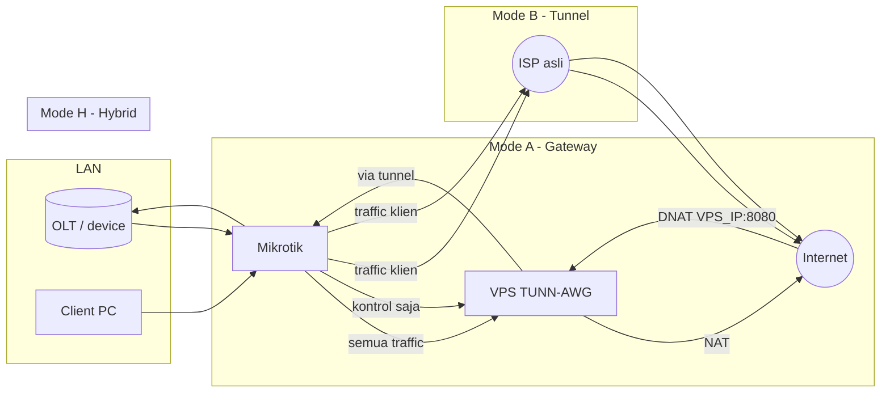

# Mode Gateway / Tunnel / Hybrid

TUNN-AWG punya tiga mode yang bisa di-toggle kapan saja dari menu (`vpn → 4`) atau bot
(`mode gateway|tunnel|hybrid`).

## Ringkasan

| Aspek | Gateway (A) | Tunnel (B) | Hybrid (H) — default |
|---|---|---|---|
| Traffic klien LAN Mikrotik | Semua via VPS | Via ISP asli | Via ISP asli |
| IP publik yang dilihat dunia | IP VPS | IP ISP asli | IP ISP asli, kecuali port-forward |
| Ekspos service LAN (mis. OLT) | Otomatis via NAT | Tidak bisa | Ya, per port on-demand |
| Latency naik | Ya, semua traffic | Tidak (hanya kontrol) | Hanya untuk port yang diforward |
| Konsumsi bandwidth VPS | Tinggi | Rendah | Sedang |
| Risiko down internet klien saat VPS mati | Ya | Tidak | Tidak (kecuali service yg diforward) |

## Alur data



## Kapan pakai mode apa?

- **Gateway** — jika ISP asli Anda CGNAT/tanpa IP publik dan Anda **butuh IP publik statis** untuk seluruh downstream. Cocok untuk kasus ISP kecil yang cuma dapat CGNAT dari upstream tapi ingin memberi klien alamat publik.
- **Tunnel** — jika Anda hanya perlu remote akses Winbox / SSH / API Mikrotik dari mana saja tanpa mengubah rute internet klien. Paling ringan dan aman.
- **Hybrid** — pilihan **default** untuk kasus paling umum: internet klien tetap cepat lewat ISP asli, tapi Anda bisa **expose port service tertentu** (panel OLT, IP camera, mikrotik winbox 8291, DVR, dsb.) via IP publik VPS.

## Contoh Hybrid dalam praktek

Anda punya:
- OLT ZTE di `192.168.88.10` web-panel port 80.
- Winbox Mikrotik LAN IP `192.168.88.1` port 8291.

Setelah tunnel L2TP up, dari menu (`vpn → 4 → 5`) atau bot:

```
forward port 8080 ke 192.168.88.10:80 tcp
forward port 8291 ke 192.168.88.1:8291 tcp
```

Sekarang:
- `http://VPS_IP:8080` → panel OLT.
- Winbox connect ke `VPS_IP:8291` → langsung ke Mikrotik LAN.

Semua ini **tanpa mengubah rute internet klien** — trafik broadcast normal tetap keluar via WAN ISP.

## Konsekuensi keamanan

- Setiap port yang di-forward = 1 pintu masuk baru dari internet. Batasi source IP di `/ip firewall filter` Mikrotik atau `iptables` VPS jika perlu.
- Mode Gateway = trafik klien menjejak IP publik VPS → pertimbangkan TOS/log retention penyedia VPS Anda.

## Cara switching

```bash
vpn → 4 → 1 (gateway) / 2 (tunnel) / 3 (hybrid)
```

Atau via bot Telegram:
```
mode gateway
mode tunnel
mode hybrid
```

Switching aman diulang; rule iptables di-tag `tunn-awg` sehingga tidak menyentuh rule Anda yang lain.
